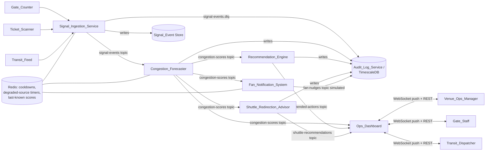
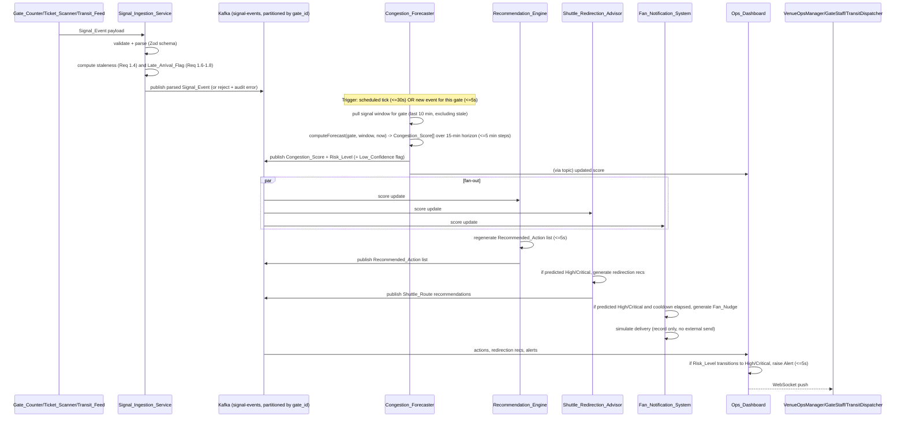

# Design Document: Stadium Congestion Forecasting System

## Overview

The Congestion_Forecasting_System is a real-time, event-driven pipeline that turns scattered Signal_Events (gate counts, ticket scans, transit arrivals) into a ranked, explained set of actions for ops staff, transit dispatchers, and fans, on a rolling 15-minute Forecast_Horizon.

The system is built as a chain of independently deployable, independently scalable services connected by a durable, partitioned event stream. Each subsystem named in the Glossary (Signal_Ingestion_Service, Congestion_Forecaster, Recommendation_Engine, Shuttle_Redirection_Advisor, Fan_Notification_System, Ops_Dashboard, plus an Audit_Log_Service) maps to one service. Services communicate exclusively through the event stream and two shared read stores (a low-latency state store and a durable time-series/audit store), which keeps the "transport vs. logic vs. UI" boundaries clean and lets each subsystem be tested and scaled on its own.

Two forces drive every technology and structure decision in this design:

1. **Requirement 12's latency budget** (10s end-to-end, 30s per-gate recompute cadence, 5s reaction to score/risk changes) requires per-Gate parallelism and push-based delivery rather than polling.
2. **Requirements 4, 6, and 9's correctness properties** require that scoring, ranking, and nudge-triggering be pure, deterministic functions over explicit inputs (a Signal_Event window and a clock), decoupled from I/O, so they can be property-tested with hundreds of generated inputs without touching Kafka, Redis, or Postgres.

## Architecture

### Technology Choices and Rationale

| Concern | Choice | Rationale |
|---|---|---|
| Service language | TypeScript (Node.js) | One language across ingestion, scoring, ranking, and dashboard simplifies sharing the Signal_Event schema/types and the pure scoring/ranking modules between services and tests. Strong ecosystem for both event-stream consumers and WebSocket dashboards. |
| Event backbone | Apache Kafka (topics partitioned by `gate_id`/`route_id`) | Requirement 12.4 requires priority-aware processing under overload and Requirement 3.1/3.3 require sub-30s, sub-5s reactive recompute per Gate. Partitioning by Gate_Id gives each Gate an independent, ordered, replayable log so gates don't contend with each other, and consumer groups let each subsystem scale horizontally. Kafka's durable log also directly backs the 90-day audit retention (Requirement 13.4) via a dedicated compacted/retained audit topic feeding the audit store. |
| Low-latency shared state | Redis | Cooldown tracking (Requirement 8.4/9.1), degraded-source timers (Requirement 1.5), and "last known Congestion_Score" for the outdated-fallback path (Requirement 12.3) all need sub-millisecond read/write with TTL semantics, which Redis provides natively. |
| Durable store (time-series + audit) | PostgreSQL with TimescaleDB extension | Signal_Events, Congestion_Score history, Recommended_Actions, Fan_Nudges, and audit records are all timestamped, queried by time range and Gate_Id, and require a 90-day retention policy (Requirement 13.4). TimescaleDB gives native retention/compression policies and efficient time-range queries over plain Postgres, while keeping full SQL for dashboard queries. |
| Schema/validation | Zod | Defines the Signal_Event schema once as executable TypeScript, produces both the parser (`schema.parse`) and a serializer (a matching `toWire` function) needed for the round-trip properties in Requirement 2, and gives precise per-field validation errors (naming the offending field, satisfying Requirement 1.3/2.5). |
| Dashboard transport | WebSocket (push) for live score/risk/alert updates, REST for queries, action execution, and accept/reject actions | Requirement 10.2/10.3 require dashboard updates within 5s of a risk transition and at least every 30s without manual reload; push delivery meets this without polling overhead. REST remains simpler for one-shot commands (execute action, acknowledge alert, accept/reject redirection). |
| Property-based testing | fast-check (TypeScript) | Mature PBT library for the chosen language, supports custom arbitraries for Signal_Event/Gate/Congestion_Score generators and shrinking on failure, integrates with Vitest. |
| Test runner | Vitest | Fast, TypeScript-native, integrates directly with fast-check. |

### High-Level Pipeline



All inter-service data (Signal_Events, Congestion_Scores, Recommended_Actions, Shuttle recommendations, Fan_Nudges, Alerts) flows through Kafka topics partitioned by `gate_id` (or `route_id` for shuttle topics), so all events for a given Gate are processed in order by a single partition, which is what makes the Requirement 4/6/9 determinism and monotonicity properties achievable: a Gate's Congestion_Score and Recommended_Action list are pure functions of the ordered Signal_Event history for that Gate plus the current clock.

### Forecast_Horizon Computation Loop (Sequencing)

The Congestion_Forecaster runs a per-Gate scheduled recompute (at least every 30s per Requirement 3.1) plus an event-triggered recompute (within 5s of new Signal_Events per Requirement 3.3). Both paths call the same pure `computeForecast(gate, signalWindow, now)` function, which is what the correctness properties in this design target.



## Components and Interfaces

### Signal_Ingestion_Service

Responsibilities: accept Signal_Events over HTTP, validate against the Signal_Event schema, compute staleness and Late_Arrival_Flag, mark sources degraded on timeout, publish to Kafka, prioritize under overload.

**API surface**

- `POST /v1/signals` — body: raw Signal_Event payload (JSON). Returns `202 Accepted` with the parsed Signal_Event's assigned `signal_id`, or `400 Bad Request` with a `ValidationError` (source, reason, offending field, raw payload) per Requirement 1.3/2.5.
- `GET /v1/sources/{gate_or_route_id}/status` — returns per-source (Gate_Counter/Ticket_Scanner/Transit_Feed) `active | degraded` status and last-seen timestamp, backing the dashboard's data-quality indicator (Requirement 11.1).

**Internal interface** (pure, unit/property-testable):

```typescript
function parseSignalEvent(payload: unknown): Result<SignalEvent, ValidationError>;
function serializeSignalEvent(event: SignalEvent): SignalEventPayload;
function classifyTiming(event: SignalEvent, receivedAt: Date, config: TimingConfig): {
  isStale: boolean;        // Req 1.4
  lateArrivalFlag: boolean; // Req 1.6-1.8
};
```

`TimingConfig` holds `staleThresholdMs` (60_000) and `lateArrivalThresholdMs` (configurable), consumed independently, which is what makes the Requirement 1.7 independence property true by construction: `isStale` and `lateArrivalFlag` are computed from two separate threshold comparisons over the same two timestamps, with no branch making one depend on the other.

Degraded-source detection is a timer per `(sourceType, gateOrRouteId)` key stored in Redis with a TTL equal to the configured source-specific timeout; a background sweep (or Redis keyspace-notification consumer) flips the source to `degraded` when the TTL expires (Requirement 1.5), and clears it on the next Signal_Event from that source.

Overload prioritization (Requirement 12.4): the HTTP intake layer writes into an in-memory bounded priority queue keyed by the target Gate's *current* Risk_Level (read from the Redis score cache) before handing off to the Kafka producer; when the queue is at capacity, lower-priority (Low/Moderate gate) events are the ones deferred/dropped-and-retried first.

### Congestion_Forecaster

Responsibilities: compute Congestion_Score/Risk_Level per Gate across the Forecast_Horizon, flag Low_Confidence, fall back to last-known score when computation is missed.

**Pure core** (property-tested directly, no I/O):

```typescript
function computeForecast(
  gate: Gate,
  window: SignalEvent[],   // non-stale events for this gate, last 10 minutes
  now: Date
): ForecastResult; // { scores: CongestionScorePoint[], lowConfidence: boolean }

function deriveRiskLevel(score: number): RiskLevel; // fixed ranges, Req 3.4/4.3
```

`ForecastResult.scores` is an array of `{ offsetMinutes: number; score: number; riskLevel: RiskLevel }` covering `0..15` minutes in steps `<= 5` minutes (Requirement 3.2).

**Service wrapper** (I/O, integration-tested): a scheduler ticks every gate at least every 30s; a Kafka consumer on `signal-events` triggers an ad-hoc recompute for the affected Gate within 5s. If a scheduled or triggered computation does not complete within 30s (Requirement 12.3), the wrapper publishes the last-known score read from Redis with an `outdated: true` flag instead of skipping the update.

**API surface** (for dashboard/other services, read-only — mutation happens only via the pipeline):

- `GET /v1/gates/{gate_id}/forecast` — current Congestion_Score series across the Forecast_Horizon, Risk_Level, `lowConfidence`, `outdated` flags.

### Recommendation_Engine

Responsibilities: generate ranked, explained Recommended_Actions per Gate; regenerate on score change; remove stale actions when a Gate drops below Moderate.

**Pure core:**

```typescript
function generateRecommendations(
  gate: Gate,
  forecast: ForecastResult,
  window: SignalEvent[]
): RecommendedAction[]; // ranked, Action_Rank starting at 1
```

Internally this scores each candidate action type (open lane, redirect shuttle, hold transit arrival, fan-nudge campaign) by a deterministic predicted risk-reduction impact function of the current window/forecast, sorts descending, and assigns sequential ranks — this is the function targeted by the Requirement 6 sort-order and rank-permutation properties.

**API surface:**

- `GET /v1/gates/{gate_id}/actions` — active Recommended_Action list with rank, Explanation, action type, execution status.
- `POST /v1/gates/{gate_id}/actions/{action_id}/execute` — body: `{ userId }`. Records execution time + acting user (Requirement 5.5), returns updated action.

### Shuttle_Redirection_Advisor

**Pure core:**

```typescript
function generateRedirections(
  originGate: Gate,
  forecastsByGate: Map<GateId, ForecastResult>,
  assignedRoutes: ShuttleRoute[],
  recentRejections: RejectionRecord[]
): ShuttleRedirectionRecommendation[];
```

Filters candidate alternative Gates to those with a strictly lower predicted Risk_Level than `originGate` (Requirement 7.5), and excludes any recommendation identical to one rejected for the same route within the last 5 minutes (Requirement 7.4).

**API surface:**

- `GET /v1/routes/{route_id}/redirections` — active recommendation(s) for a route.
- `POST /v1/routes/{route_id}/redirections/{rec_id}/accept` — body: `{ dispatcherId }`. Records acceptance time, dispatcher, resulting assignment (Requirement 7.3).
- `POST /v1/routes/{route_id}/redirections/{rec_id}/reject` — body: `{ dispatcherId }`. Records rejection, starts the 5-minute suppression window (Requirement 7.4).

### Fan_Notification_System

**Pure core:**

```typescript
function generateFanNudge(
  fan: FanContext,
  originGate: Gate,
  forecastsByGate: Map<GateId, ForecastResult>,
  lastNudgeAt: Date | null,
  now: Date
): FanNudge | null; // null if suppressed by cooldown or trigger condition not met
```

Simulated delivery is a separate, side-effecting step: `simulateDelivery(nudge)` writes `{ fanId, message, targetGate, simulatedDeliveryTimestamp }` to the audit/nudge store and never calls an external messaging provider (Requirement 8.3) — verified with a mock-based test asserting zero calls to any outbound network client.

Cooldown state (`lastNudgeAt` per `(fanId, gateId)`) lives in Redis with the Cooldown_Period as context (not necessarily a hard TTL, since a nudge may be cancelled before delivery per Requirement 8.5, and cancellation must not reset the cooldown clock incorrectly — the cooldown key is set at *generation* time, not at delivery time).

**API surface:** internal only (no external fan-facing API, since delivery is simulated); an operator-facing read endpoint:

- `GET /v1/nudges?gateId=&fanId=` — audit view of generated/cancelled/simulated-delivered nudges.

### Ops_Dashboard

Responsibilities: aggregate and display per-Gate score/risk/actions, alerts, data-quality indicators; accept acknowledgments.

**API surface:**

- `WS /v1/dashboard/stream` — push channel emitting `ScoreUpdate`, `ActionListUpdate`, `RedirectionUpdate`, `Alert` events as they occur (drives the <=5s alert and <=30s refresh requirements).
- `GET /v1/dashboard/gates` — snapshot of all Gates' current score, Risk_Level, active actions, data-quality indicator (initial load / reconnect fallback).
- `POST /v1/alerts/{alert_id}/acknowledge` — body: `{ userId }`. Records acknowledgment time and user (Requirement 10.4).

### Audit_Log_Service

Responsibilities: durable, queryable record of every score computation, action, redirection decision, and Fan_Nudge, retained >= 90 days.

**API surface:**

- `GET /v1/audit/scores?gateId=&from=&to=`
- `GET /v1/audit/actions?gateId=&from=&to=`
- `GET /v1/audit/nudges?fanId=&gateId=&from=&to=`

Implemented as a Kafka consumer group that writes every message from `signal-events` (incl. DLQ), `congestion-scores`, `recommended-actions`, `shuttle-recommendations`, and `fan-nudges` into TimescaleDB hypertables with a 90-day retention policy per table.

## Data Models

```typescript
type GateId = string;
type RouteId = string;
type FanId = string;

interface Gate {
  gateId: GateId;
  name: string;
  capacityThreshold: number; // Capacity_Threshold
  assignedRouteIds: RouteId[];
}

interface ShuttleRoute {
  routeId: RouteId;
  servedGateIds: GateId[];
}

type SignalSource = "GATE_COUNTER" | "TICKET_SCANNER" | "TRANSIT_FEED";

interface SignalEvent {
  signalId: string;
  source: SignalSource;
  gateId?: GateId;      // present for Gate_Counter / Ticket_Scan
  routeId?: RouteId;     // present for Transit_Arrival
  timestamp: string;     // ISO 8601, event-reported time
  receivedAt: string;    // ISO 8601, ingestion receipt time
  payload: GateCounterPayload | TicketScanPayload | TransitArrivalPayload;
  isStale: boolean;          // Req 1.4
  lateArrivalFlag: boolean;  // Req 1.6-1.8, independent of isStale
}

interface GateCounterPayload { count: number; intervalSeconds: number; }
interface TicketScanPayload { fanId: FanId; }
interface TransitArrivalPayload {
  estimatedPassengerCount: number;
  destinationGateId?: GateId;
  destinationRouteId?: RouteId;
  fanIds?: FanId[];
}

type RiskLevel = "LOW" | "MODERATE" | "HIGH" | "CRITICAL";

interface CongestionScorePoint {
  gateId: GateId;
  forecastTime: string;   // absolute time this point predicts
  offsetMinutes: number;  // 0..15, step <= 5
  score: number;          // 0..100 inclusive
  riskLevel: RiskLevel;
  lowConfidence: boolean; // Req 3.5, 11.2
  outdated: boolean;      // Req 12.3
}

type ActionType = "OPEN_GATE_LANE" | "REDIRECT_SHUTTLE_ROUTE" | "HOLD_TRANSIT_ARRIVAL" | "FAN_NUDGE_CAMPAIGN";

interface RecommendedAction {
  actionId: string;
  gateId: GateId;
  actionType: ActionType;
  actionRank: number;       // 1 = highest priority, unique per (gateId, forecastTime)
  explanation: string;      // references contributing signalIds / score factors; includes
                             // "Low_Confidence" token when derived from a Low_Confidence score
  targetGateId?: GateId;
  targetRouteId?: RouteId;
  generatedAt: string;
  executedAt?: string;
  executedByUserId?: string;
}

interface ShuttleRedirectionRecommendation {
  recommendationId: string;
  routeId: RouteId;
  originGateId: GateId;
  alternativeGateId: GateId;   // riskLevel strictly lower than originGateId's
  explanation: string;          // references Congestion_Score + Transit_Arrival data
  generatedAt: string;
  status: "PENDING" | "ACCEPTED" | "REJECTED";
  acceptedAt?: string;
  acceptedByDispatcherId?: string;
  rejectedAt?: string;
  rejectedByDispatcherId?: string;
}

interface FanNudge {
  nudgeId: string;
  fanId: FanId;
  originGateId: GateId;          // riskLevel HIGH/CRITICAL at generation time
  alternativeGateId?: GateId;    // riskLevel strictly lower than originGateId's, if provided
  alternativeArrivalTime?: string;
  alternativeRouteId?: RouteId;
  message: string;
  generatedAt: string;
  simulatedDeliveryTimestamp?: string;
  status: "QUEUED" | "SIMULATED_DELIVERED" | "CANCELLED";
}

interface Alert {
  alertId: string;
  gateId: GateId;
  alertType: "RISK_LEVEL" | "DATA_QUALITY"; // Req 10.2 vs Req 11.4
  raisedAt: string;
  riskLevel?: RiskLevel;         // for RISK_LEVEL alerts
  affectedSources?: SignalSource[]; // for DATA_QUALITY alerts
  acknowledgedAt?: string;
  acknowledgedByUserId?: string;
}

interface ValidationErrorRecord {
  errorId: string;
  source: SignalSource | "UNKNOWN";
  reason: string;
  offendingField?: string;
  rawPayload: unknown;
  recordedAt: string;
}

// Audit records: one per computation/generation, immutable, retained >= 90 days
interface ScoreAuditRecord {
  gateId: GateId;
  timestamp: string;
  score: number;
  riskLevel: RiskLevel;
  contributingSignalIds: string[];
  contributingSignalLateArrivalFlags: Record<string, boolean>; // Req 13.5
}
interface ActionAuditRecord extends RecommendedAction {}
interface NudgeAuditRecord extends FanNudge {}
```

## Correctness Properties

*A property is a characteristic or behavior that should hold true across all valid executions of a system—essentially, a formal statement about what the system should do. Properties serve as the bridge between human-readable specifications and machine-verifiable correctness guarantees.*

The prework analysis above classified each acceptance criterion and flagged which behaviors vary meaningfully with input (candidates for property-based testing over the pure `parseSignalEvent`/`serializeSignalEvent`/`computeForecast`/`generateRecommendations`/`generateRedirections`/`generateFanNudge` functions) versus which are latency/availability/configuration checks better suited to integration or smoke tests (e.g., the 2s/5s/10s/30s timing bounds in Requirements 1.1, 3.1, 3.3, 5.6, 10.2/10.3, 12.1/12.2, and the 90-day retention in 13.4). The property reflection step then merged properties that were logically redundant (e.g., Requirement 3.4 and 4.3 describe the same Risk_Level range invariant; Requirements 8.1/9.2/9.3 describe one triggering condition stated three ways; Requirements 8.4/9.1 describe one cooldown behavior). What remains below is the deduplicated set, grouped by subsystem, each implementable as a single fast-check property test running at least 100 iterations against the corresponding pure function.

### Signal Ingestion

#### Property 1: Ingestion preserves source, target, timestamp, and payload
For any valid Signal_Event payload from a Gate_Counter, Ticket_Scanner, or Transit_Feed, parsing the payload SHALL produce a structured Signal_Event whose source, Gate_Id/Route_Id, timestamp, and payload match the input.
**Validates: Requirements 1.1, 1.2**

#### Property 2: Non-conforming payloads are rejected with a diagnosable error
For any payload that violates the Signal_Event schema (missing required field, extra unexpected structure, or wrong-typed field), parsing SHALL fail and the resulting ValidationError SHALL contain the source, a reason, and the raw payload.
**Validates: Requirements 1.3, 2.5**

#### Property 3: Staleness threshold is applied consistently
For any Signal_Event, the event is marked stale if and only if `receivedAt - timestamp >= 60s`; stale events SHALL be excluded from the active-computation signal window.
**Validates: Requirements 1.4**

#### Property 4: Degraded-source marking follows elapsed silence
For any source and any configured timeout, if no Signal_Event has been received from that source for at least the timeout duration, the source SHALL be marked degraded for its associated Gate or Shuttle_Route; receiving a new Signal_Event SHALL clear the degraded mark.
**Validates: Requirements 1.5**

#### Property 5: Late-arrival recording is complete and independent of staleness
For any Signal_Event and any combination of delay-from-timestamp-to-receipt and age-from-timestamp-to-now, the recorded Late_Arrival_Flag SHALL be true if and only if the delay meets or exceeds the Late_Arrival_Threshold, the event SHALL be retained (never discarded) regardless of the flag's value, the original timestamp and receipt timestamp SHALL both remain present and unchanged, and the Late_Arrival_Flag's value SHALL be independent of whether the same event is separately marked stale (a Late_Arrival_Flag of true SHALL be reachable together with `isStale = false`).
**Validates: Requirements 1.6, 1.7, 1.8**

### Parsing and Serialization

#### Property 6: Parse-then-serialize round trip
For any valid Signal_Event payload, parsing it into a structured Signal_Event and then serializing that object SHALL produce a payload equivalent to the original input.
**Validates: Requirements 2.1, 2.2, 2.3**

#### Property 7: Serialize-then-parse round trip, including Late_Arrival_Flag
For any structured Signal_Event object (including ones with Late_Arrival_Flag set to true), serializing it and then parsing the result SHALL produce a Signal_Event object equivalent to the original, with the Late_Arrival_Flag preserved.
**Validates: Requirements 2.4, 2.6, 2.7**

### Congestion Forecasting

#### Property 8: Congestion_Score is always bounded
For any Gate and any set of Signal_Events, the computed Congestion_Score at any point in the Forecast_Horizon SHALL be between 0 and 100 inclusive.
**Validates: Requirements 4.1**

#### Property 9: Congestion_Score is monotonic in incoming count
For any Gate and any two Signal_Event sets that differ only in total incoming count with all other factors held equal, the set with the greater or equal total incoming count SHALL receive a Congestion_Score greater than or equal to the other set's score.
**Validates: Requirements 4.2**

#### Property 10: Risk_Level is consistent with fixed score ranges
For any computed Congestion_Score, the derived Risk_Level SHALL equal Low for scores 0-39, Moderate for 40-69, High for 70-89, and Critical for 90-100.
**Validates: Requirements 3.4, 4.3**

#### Property 11: Congestion_Score computation is deterministic
For any Gate, any fixed set of Signal_Events, and any fixed forecast time, repeated computation of the Congestion_Score SHALL produce the same result every time.
**Validates: Requirements 4.4**

#### Property 12: Empty input yields a defined default, not an error
For any Gate with an empty Signal_Event set, the computed Congestion_Score SHALL be 0 with Risk_Level Low, and no error SHALL be raised.
**Validates: Requirements 4.5**

#### Property 13: Forecast output covers the full horizon in bounded steps
For any Gate and any Signal_Event set, the returned Congestion_Score series SHALL cover offsets from 0 to 15 minutes with no gap between consecutive offsets larger than 5 minutes.
**Validates: Requirements 3.2**

#### Property 14: Signal gaps produce Low_Confidence without discarding history
For any Gate whose non-stale Signal_Events all fall outside the preceding 10 minutes, the forecast SHALL be flagged Low_Confidence and SHALL retain (not discard) the prior Congestion_Score.
**Validates: Requirements 3.5**

### Recommendation Ranking

#### Property 15: Moderate-or-higher risk always yields at least one action
For any Gate whose computed Risk_Level is Moderate, High, or Critical, the generated Recommended_Action list for that Gate SHALL be non-empty.
**Validates: Requirements 5.1**

#### Property 16: Every action's explanation names its contributing signals
For any generated Recommended_Action, its Explanation SHALL reference at least one of the specific Signal_Event identifiers or Congestion_Score factors that produced it, and SHALL include a Low_Confidence indicator whenever the source Congestion_Score was flagged Low_Confidence.
**Validates: Requirements 5.3, 11.3**

#### Property 17: Action type is always one of the defined types
For any generated Recommended_Action, its action type SHALL be one of: open additional Gate lane, redirect Shuttle_Route, hold Transit_Arrival, issue Fan_Nudge campaign.
**Validates: Requirements 5.4**

#### Property 18: Execution attributes the acting user and time
For any Recommended_Action and any user who marks it executed, the resulting record SHALL contain that user's identity and the execution time.
**Validates: Requirements 5.5**

#### Property 19: Recommended_Actions are sorted by descending impact
For any Gate with two or more Recommended_Actions at the same forecast time, ordering them by Action_Rank SHALL yield non-increasing predicted risk-reduction impact.
**Validates: Requirements 6.1**

#### Property 20: Action_Ranks form a contiguous permutation
For any Recommended_Action list of length N generated by the Recommendation_Engine, the set of Action_Ranks SHALL equal exactly `{1, ..., N}` with no duplicates and no gaps.
**Validates: Requirements 5.2, 6.2**

#### Property 21: Recommendation generation is deterministic
For any Gate, any fixed Signal_Event set, and any fixed Congestion_Score, re-running the Recommendation_Engine SHALL produce the same actions with the same Action_Ranks.
**Validates: Requirements 6.3**

#### Property 22: Dropping below Moderate removes prior actions
For any Gate whose Congestion_Score drops below the Moderate threshold, the active Recommended_Action list for that Gate SHALL no longer contain actions generated while it was at or above Moderate.
**Validates: Requirements 6.4**

### Shuttle Redirection

#### Property 23: High/Critical prediction covers every assigned route
For any Gate predicted to reach High or Critical Risk_Level within the Forecast_Horizon, every Shuttle_Route currently assigned to that Gate SHALL receive a redirection recommendation naming an alternative Gate or drop-off point.
**Validates: Requirements 7.1**

#### Property 24: Redirection explanation cites its inputs
For any Shuttle_Route redirection recommendation, its Explanation SHALL reference the predicted Congestion_Score and Transit_Arrival data that produced it.
**Validates: Requirements 7.2**

#### Property 25: Acceptance attributes dispatcher, time, and assignment
For any redirection recommendation accepted by a Transit_Dispatcher, the resulting record SHALL contain the acceptance time, the dispatcher's identity, and the resulting Shuttle_Route assignment.
**Validates: Requirements 7.3**

#### Property 26: Rejection suppresses identical recommendations for 5 minutes
For any redirection recommendation rejected by a Transit_Dispatcher, no identical recommendation for the same Shuttle_Route SHALL be regenerated within the following 5 minutes.
**Validates: Requirements 7.4**

#### Property 27: Redirection targets are always lower risk than the origin
For any Shuttle_Route redirection recommendation, the alternative Gate's predicted Risk_Level SHALL be strictly lower than the originating Gate's predicted Risk_Level.
**Validates: Requirements 7.5**

### Fan Notification

#### Property 28: Fan_Nudge always carries at least one usable alternative
For any generated Fan_Nudge, at least one of alternative Gate, alternative arrival time, or alternative Shuttle_Route SHALL be populated.
**Validates: Requirements 8.2**

#### Property 29: Simulated delivery records complete data with no external transmission
For any Fan_Nudge that reaches simulated delivery, the resulting record SHALL contain the fan identifier, message content, target Gate, and simulated delivery timestamp, and no call SHALL be made to any external messaging provider.
**Validates: Requirements 8.3**

#### Property 30: Risk downgrade before delivery cancels the queued nudge
For any queued Fan_Nudge, if the target Gate's Risk_Level returns to Low or Moderate before the nudge is simulated as delivered, the nudge SHALL be cancelled rather than delivered.
**Validates: Requirements 8.5**

#### Property 31: Cooldown prevents repeat nudges to the same fan and Gate
For any fan and Gate pair, once a Fan_Nudge has been generated, no second Fan_Nudge for that same fan and Gate SHALL be generated until the Cooldown_Period has elapsed.
**Validates: Requirements 8.4, 9.1**

#### Property 32: A Fan_Nudge exists for a fan/Gate at time T if and only if that Gate is High/Critical at T
For any fan, Gate, and generation time T (outside any active cooldown), a Fan_Nudge referencing that Gate as origin SHALL be generated if and only if the Gate's predicted Risk_Level at T is High or Critical; consequently Gates at Low or Moderate Risk_Level SHALL have zero Fan_Nudges generated with them as origin.
**Validates: Requirements 8.1, 9.2, 9.3**

#### Property 33: Fan_Nudge alternative Gate is always lower risk than the origin
For any Fan_Nudge that recommends an alternative Gate, that alternative Gate's predicted Risk_Level SHALL be strictly lower than the origin Gate's predicted Risk_Level at generation time.
**Validates: Requirements 9.4**

### Dashboard and Data Quality

#### Property 34: Dashboard snapshot is complete per Gate
For any set of Gates with current scores, Risk_Levels, and active Recommended_Actions, the dashboard snapshot SHALL include, for every Gate, its Congestion_Score, Risk_Level, and for every active Recommended_Action its Action_Rank, Explanation, and execution status.
**Validates: Requirements 10.1, 10.5**

#### Property 35: Risk transition to High/Critical always raises a visible Alert
For any Gate whose Risk_Level transitions from Low/Moderate to High/Critical, an Alert SHALL be generated referencing that Gate and SHALL be marked visible to the Venue_Ops_Manager, the Gate_Staff assigned to that Gate, and the Transit_Dispatcher.
**Validates: Requirements 10.2**

#### Property 36: Acknowledgment attributes user and time
For any Alert acknowledged by a Venue_Ops_Manager or Transit_Dispatcher, the resulting record SHALL contain the acknowledgment time and the acknowledging user's identity.
**Validates: Requirements 10.4**

#### Property 37: Degraded sources always surface a data-quality indicator
For any Gate with at least one currently degraded source, the dashboard view for that Gate SHALL carry a data-quality indicator alongside its Congestion_Score.
**Validates: Requirements 11.1**

#### Property 38: Scores computed from stale/degraded input are flagged Low_Confidence
For any Congestion_Score computed using a signal window that contains at least one stale or degraded-source-originated Signal_Event, the resulting score SHALL be flagged Low_Confidence.
**Validates: Requirements 11.2**

### Performance and Resilience

#### Property 39: Missed computation falls back to a marked last-known score
For any Gate whose scheduled Congestion_Score computation does not complete within 30 seconds, the dashboard SHALL display the last known Congestion_Score for that Gate marked as outdated rather than displaying no value.
**Validates: Requirements 12.3**

#### Property 40: Overload processing prioritizes by current Risk_Level
For any set of pending Signal_Events spanning multiple Gates at different current Risk_Levels, when total load exceeds throughput capacity, Signal_Events for Gates with a higher current Risk_Level SHALL be processed before those for Gates with a lower current Risk_Level.
**Validates: Requirements 12.4**

### Audit Logging

#### Property 41: Score audit records round-trip the computation inputs and outputs
For any Congestion_Score computation, the resulting audit record SHALL contain the Gate_Id, timestamp, score, Risk_Level, and the identifiers of the Signal_Events used to produce it, matching the inputs and output of that computation.
**Validates: Requirements 13.1**

#### Property 42: Action and nudge audit records round-trip generation data
For any Recommended_Action generated, its audit record SHALL contain the Explanation, Action_Rank, and eventual execution status matching the generated action; for any Fan_Nudge generated, its audit record SHALL contain the target Gate, recommended alternative, and simulated delivery status matching the generated nudge.
**Validates: Requirements 13.2, 13.3**

#### Property 43: Late_Arrival_Flag is recorded in the audit trail independent of staleness/exclusion
For any Signal_Event, regardless of whether it was marked stale or excluded from active Congestion_Score computation, its audit record SHALL carry the same Late_Arrival_Flag value that was set at ingestion time.
**Validates: Requirements 13.5**

## Error Handling

| Failure scenario | Handling |
|---|---|
| Malformed/non-conforming Signal_Event payload (Req 1.3, 2.5) | `parseSignalEvent` returns a typed `Result` error (never throws for expected validation failures); Signal_Ingestion_Service responds `400` and writes a `ValidationErrorRecord` (source, reason, offending field, raw payload) to the `signal-events.dlq` topic, consumed into the audit store. The event is never forwarded to `signal-events`. |
| Stale Signal_Event (Req 1.4) | Recorded normally (not rejected) with `isStale = true`; the Congestion_Forecaster's window query excludes `isStale = true` events from the active computation set but the Audit_Log_Service still records them (satisfies Req 13.5's "independent of exclusion"). |
| Source silence / degraded source (Req 1.5) | Detected via Redis TTL expiry, not an exception path; downstream, any Congestion_Score computed from a window containing a degraded-source event is flagged `lowConfidence = true` (Req 11.2), and if *all* sources for a Gate are simultaneously degraded, the Ops_Dashboard raises a distinct `DATA_QUALITY` Alert (Req 11.4) separate from a `RISK_LEVEL` Alert. |
| Congestion_Forecaster misses its computation deadline (Req 12.3) | The scheduler wraps each per-Gate computation with a 30s timeout; on timeout, it does not retry-and-block but immediately publishes the last-known score (read from Redis) with `outdated = true`, and logs the timeout for operational visibility. The next scheduled tick attempts a fresh computation normally. |
| Ingestion overload (Req 12.4) | The intake priority queue sheds/delays lowest-Risk_Level-Gate traffic first rather than failing indiscriminately; shed events are retried from the producer's local buffer with backoff, not silently dropped, and a `queue_depth`/`shed_count` metric is emitted for operators. |
| Kafka consumer failure / crash mid-processing | Each service commits Kafka offsets only after successful downstream write (at-least-once processing); the pure compute functions (`computeForecast`, `generateRecommendations`, etc.) are idempotent/deterministic (Req 4.4, 6.3), so re-processing a Signal_Event or re-running a computation after a crash recovery produces the same result rather than corrupting state. |
| Redis unavailability (cooldown/degraded-source/last-known-score store) | Treated as a dependency failure, not a silent default: Fan_Notification_System fails closed on cooldown checks it cannot verify (suppresses rather than risks double-send), while degraded-source detection and last-known-score fallback log the outage and surface a system-level health alert on the Ops_Dashboard rather than fabricating a status. |
| Rejected Shuttle_Route redirection re-triggering (Req 7.4) | Rejection is recorded with a 5-minute suppression window keyed by `(routeId, recommendation content hash)` in Redis; the Shuttle_Redirection_Advisor checks this key before emitting a new recommendation for that route. |
| Fan_Nudge race between generation and Risk_Level downgrade (Req 8.5) | Nudges are held in a `QUEUED` state until the simulated-delivery step executes; the delivery step re-checks the target Gate's current Risk_Level immediately before marking `SIMULATED_DELIVERED`, and transitions to `CANCELLED` instead if the Gate has since dropped to Low/Moderate. |

## Testing Strategy

**Property-based tests** (fast-check, >= 100 iterations per test, one test per design property) cover the pure, input-varying logic identified above: parsing/serialization round trips, staleness/late-arrival classification, forecast scoring (bounds, monotonicity, determinism, Risk_Level mapping, horizon coverage, Low_Confidence propagation), recommendation ranking (sort order, rank permutation, determinism, triggering, removal), shuttle redirection (triggering, risk-lower invariant, rejection suppression), fan nudge triggering (cooldown, iff-triggering, risk-lower invariant), dashboard snapshot completeness, and audit round-trips. Each test is tagged in the form `Feature: stadium-congestion-forecasting, Property {n}: {property title}` and calls the corresponding pure function directly (no Kafka/Redis/Postgres in the property test itself) — external dependencies are exercised separately via integration tests. Custom fast-check arbitraries will generate: valid/invalid Signal_Event payloads (including boundary cases at exactly the 60s stale threshold and the Late_Arrival_Threshold), Signal_Event windows with configurable count/gap/source-mix, and Gate/Risk_Level configurations spanning all four bands.

**Unit tests** (Vitest) cover concrete examples and edge cases that don't need iteration: the four fixed Risk_Level range boundaries (39/40, 69/70, 89/90 exactly), the empty-input default (Req 4.5), a specific malformed payload producing a specific field-named error, a specific "all sources degraded" Alert, and specific API request/response shapes for each REST endpoint.

**Integration tests** cover the timing/liveness/infrastructure requirements that are not meaningfully improved by randomized iteration: the 2s ingestion-record latency (Req 1.1), the 30s/5s forecast recompute cadences (Req 3.1/3.3), the 5s recommendation regeneration (Req 5.6), the 5s Alert visibility and 30s dashboard refresh (Req 10.2/10.3), the 10s end-to-end pipeline latency and continuous availability (Req 12.1/12.2), and the 90-day audit retention policy configuration (Req 13.4). These run against a docker-composed Kafka/Redis/Postgres stack with 1-3 representative scenarios each rather than generated inputs, per the PBT decision guide (behavior here doesn't vary meaningfully with input; the concern is timing and infra wiring, not logic).

**Mock-based tests** verify the "no real external transmission" requirement for Fan_Nudge simulated delivery (Req 8.3) by asserting zero invocations of any outbound messaging client, and verify degraded-source/Redis-outage fail-closed behavior without needing a real Redis outage.

## Review and Approval

`requirements.md` exists and is finalized for this feature; this design traces every acceptance criterion in Requirements 1-13 to either a correctness property, a unit/edge-case test, an integration test, or an explicit non-functional handling note above. Ready for user review.
